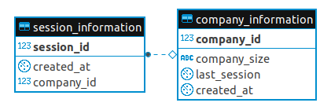

### Take Home Assignement

This **notebook** is considered as the same time as the main & README to learn how to use the package.

They is 4 different steps in the project:
1. Introduction
2. Create the Fake Database & Tables.
3. Generate the fake Dataset.
4. Report 3 relevant KPIs.


- ```git clone git@github.com:MatthieuRu/take-home-assignement.git``` *Git clone the project from Github.*
- ```./start.sh``` *Launch the docker images including the postgre server*
- ```conda env create``` *Create the conda environment based on the environment.yml.*
- ```conda activate assigenment``` *Activate the conda environment.*
- ```pytest src -v -s``` *Run the unit tests.*
- ```jupyter notebook README.ypnb``` *You can copy paste the README.ipynb and start to play with the package*

### 1. Introduction

Before to start the project, the stakeholders of these project has discussed about the expected output of the package:
- The Data Analyst & Engineer is playing the role of *Product Owner* and *Development Team*.
- The Leadership team is playing the *client*'s role. 

After the discussion, the ouptut of the KPI should cover some topics:
1. The Company's Revenue
2. The Client's Retention
3. The Product's Usage


In this context, a list of  3 KPI / 3 user stories has been approved by both team in term of getting all the information needed by the Leadership team:


**List of User story:**
1. As a a menber of the Leadership team, I want to know how many client group by company size at the month X.
1. As a a menber of the Leadership team, I want to how much is the revenu group by company size at he month X.
1. As a a menber of the Leadership team, I want to how many time our customers has used in average our product group by company size at he month X.


### 2. DB Management

The main goal of this database is to not overload the database with useless information. If we need to add a column or a table, it's because we cannot achieve a user story with the actual database structure.





```python
from src.main.assignment.db_manager.server import Server
# Connection to the server
server = Server(
    ip='0.0.0.0',
    user='application',
    passwd='secretpassword',
    database='application'
) 
```


```python
# Create the schema and the needed tables.
server._create_schema_abc('./src/main/assignment/db_manager/ABC.sql')
```


```python
# Delete the schema (if needed)
server._delete_schema_abc()
```

### 3. Generate Fake Table

**Step A. Initate the fake data generation:**
1. Create the company table for the month 0

**Step B. Implement all the followins month iteration:**
1. Filter the company still active on the product by using session_information month X-1
2. Create the session_information table for the month X


```python
from src.main.assignment.db_manager.generator import Generator
import datetime

starting_date = datetime.date(2021, 1, 1)
nb_company = 500
generator = Generator(
    starting_date,
    nb_company,
    nb_month=20
)
```


```python
# send the fake data into the database.
generator.send_to_database(server)
```


```python
# Delete the data (if needed)
generator.delete_from_database(server)
```

### 4. Report 3 relevant KPIs

The KPI is following the **scope / design** aligned at the introduction of the project.

The idea is to be able to track overtime all the relevant topics and group by the company size.

In this case, all the stakeholder has all the information needed to get:
1. An overview of the health of the company
2. Inititiate a deeper analysis (eg compare two periods - concatenate the two type of company - get number of lost company)


```python
from src.main.assignment.db_manager.get_kpi import get_kpi_usage

get_kpi_usage(server)
```


<div>
<style scoped>
    .dataframe tbody tr th:only-of-type {
        vertical-align: middle;
    }

    .dataframe tbody tr th {
        vertical-align: top;
    }

    .dataframe thead th {
        text-align: right;
    }
</style>
<table border="1" class="dataframe">
  <thead>
    <tr style="text-align: right;">
      <th></th>
      <th>period</th>
      <th>company_size</th>
      <th>nb_average_session</th>
    </tr>
  </thead>
  <tbody>
    <tr>
      <th>0</th>
      <td>2021-01-01</td>
      <td>large</td>
      <td>9</td>
    </tr>
    <tr>
      <th>1</th>
      <td>2021-01-01</td>
      <td>small</td>
      <td>5</td>
    </tr>
    <tr>
      <th>2</th>
      <td>2021-02-01</td>
      <td>large</td>
      <td>9</td>
    </tr>
    <tr>
      <th>3</th>
      <td>2021-02-01</td>
      <td>small</td>
      <td>5</td>
    </tr>
    <tr>
      <th>4</th>
      <td>2021-03-01</td>
      <td>large</td>
      <td>10</td>
    </tr>
    <tr>
      <th>5</th>
      <td>2021-03-01</td>
      <td>small</td>
      <td>5</td>
    </tr>
    <tr>
      <th>6</th>
      <td>2021-04-01</td>
      <td>large</td>
      <td>10</td>
    </tr>
    <tr>
      <th>7</th>
      <td>2021-04-01</td>
      <td>small</td>
      <td>5</td>
    </tr>
    <tr>
      <th>8</th>
      <td>2021-05-01</td>
      <td>large</td>
      <td>11</td>
    </tr>
    <tr>
      <th>9</th>
      <td>2021-05-01</td>
      <td>small</td>
      <td>4</td>
    </tr>
    <tr>
      <th>10</th>
      <td>2021-06-01</td>
      <td>large</td>
      <td>9</td>
    </tr>
    <tr>
      <th>11</th>
      <td>2021-06-01</td>
      <td>small</td>
      <td>4</td>
    </tr>
    <tr>
      <th>12</th>
      <td>2021-07-01</td>
      <td>large</td>
      <td>11</td>
    </tr>
    <tr>
      <th>13</th>
      <td>2021-07-01</td>
      <td>small</td>
      <td>4</td>
    </tr>
    <tr>
      <th>14</th>
      <td>2021-08-01</td>
      <td>large</td>
      <td>9</td>
    </tr>
    <tr>
      <th>15</th>
      <td>2021-08-01</td>
      <td>small</td>
      <td>4</td>
    </tr>
    <tr>
      <th>16</th>
      <td>2021-09-01</td>
      <td>large</td>
      <td>10</td>
    </tr>
    <tr>
      <th>17</th>
      <td>2021-09-01</td>
      <td>small</td>
      <td>4</td>
    </tr>
    <tr>
      <th>18</th>
      <td>2021-10-01</td>
      <td>large</td>
      <td>9</td>
    </tr>
    <tr>
      <th>19</th>
      <td>2021-10-01</td>
      <td>small</td>
      <td>4</td>
    </tr>
    <tr>
      <th>20</th>
      <td>2021-11-01</td>
      <td>large</td>
      <td>11</td>
    </tr>
    <tr>
      <th>21</th>
      <td>2021-11-01</td>
      <td>small</td>
      <td>4</td>
    </tr>
    <tr>
      <th>22</th>
      <td>2021-12-01</td>
      <td>large</td>
      <td>10</td>
    </tr>
    <tr>
      <th>23</th>
      <td>2021-12-01</td>
      <td>small</td>
      <td>4</td>
    </tr>
    <tr>
      <th>24</th>
      <td>2022-01-01</td>
      <td>large</td>
      <td>9</td>
    </tr>
    <tr>
      <th>25</th>
      <td>2022-01-01</td>
      <td>small</td>
      <td>4</td>
    </tr>
    <tr>
      <th>26</th>
      <td>2022-02-01</td>
      <td>large</td>
      <td>10</td>
    </tr>
    <tr>
      <th>27</th>
      <td>2022-02-01</td>
      <td>small</td>
      <td>5</td>
    </tr>
    <tr>
      <th>28</th>
      <td>2022-03-01</td>
      <td>large</td>
      <td>9</td>
    </tr>
    <tr>
      <th>29</th>
      <td>2022-03-01</td>
      <td>small</td>
      <td>5</td>
    </tr>
    <tr>
      <th>30</th>
      <td>2022-04-01</td>
      <td>large</td>
      <td>10</td>
    </tr>
    <tr>
      <th>31</th>
      <td>2022-04-01</td>
      <td>small</td>
      <td>5</td>
    </tr>
    <tr>
      <th>32</th>
      <td>2022-05-01</td>
      <td>large</td>
      <td>9</td>
    </tr>
    <tr>
      <th>33</th>
      <td>2022-05-01</td>
      <td>small</td>
      <td>4</td>
    </tr>
    <tr>
      <th>34</th>
      <td>2022-06-01</td>
      <td>large</td>
      <td>10</td>
    </tr>
    <tr>
      <th>35</th>
      <td>2022-06-01</td>
      <td>small</td>
      <td>5</td>
    </tr>
    <tr>
      <th>36</th>
      <td>2022-07-01</td>
      <td>large</td>
      <td>9</td>
    </tr>
    <tr>
      <th>37</th>
      <td>2022-07-01</td>
      <td>small</td>
      <td>5</td>
    </tr>
    <tr>
      <th>38</th>
      <td>2022-08-01</td>
      <td>large</td>
      <td>11</td>
    </tr>
    <tr>
      <th>39</th>
      <td>2022-08-01</td>
      <td>small</td>
      <td>5</td>
    </tr>
  </tbody>
</table>
</div>


```python
from src.main.assignment.db_manager.get_kpi import get_kpi_retention

get_kpi_retention(server)
```


<div>
<style scoped>
    .dataframe tbody tr th:only-of-type {
        vertical-align: middle;
    }

    .dataframe tbody tr th {
        vertical-align: top;
    }

    .dataframe thead th {
        text-align: right;
    }
</style>
<table border="1" class="dataframe">
  <thead>
    <tr style="text-align: right;">
      <th></th>
      <th>period</th>
      <th>nb_company</th>
      <th>company_size</th>
    </tr>
  </thead>
  <tbody>
    <tr>
      <th>0</th>
      <td>2021-01-01</td>
      <td>141</td>
      <td>large</td>
    </tr>
    <tr>
      <th>1</th>
      <td>2021-01-01</td>
      <td>309</td>
      <td>small</td>
    </tr>
    <tr>
      <th>2</th>
      <td>2021-02-01</td>
      <td>131</td>
      <td>large</td>
    </tr>
    <tr>
      <th>3</th>
      <td>2021-02-01</td>
      <td>270</td>
      <td>small</td>
    </tr>
    <tr>
      <th>4</th>
      <td>2021-03-01</td>
      <td>125</td>
      <td>large</td>
    </tr>
    <tr>
      <th>5</th>
      <td>2021-03-01</td>
      <td>241</td>
      <td>small</td>
    </tr>
    <tr>
      <th>6</th>
      <td>2021-04-01</td>
      <td>124</td>
      <td>large</td>
    </tr>
    <tr>
      <th>7</th>
      <td>2021-04-01</td>
      <td>216</td>
      <td>small</td>
    </tr>
    <tr>
      <th>8</th>
      <td>2021-05-01</td>
      <td>116</td>
      <td>large</td>
    </tr>
    <tr>
      <th>9</th>
      <td>2021-05-01</td>
      <td>189</td>
      <td>small</td>
    </tr>
    <tr>
      <th>10</th>
      <td>2021-06-01</td>
      <td>110</td>
      <td>large</td>
    </tr>
    <tr>
      <th>11</th>
      <td>2021-06-01</td>
      <td>166</td>
      <td>small</td>
    </tr>
    <tr>
      <th>12</th>
      <td>2021-07-01</td>
      <td>103</td>
      <td>large</td>
    </tr>
    <tr>
      <th>13</th>
      <td>2021-07-01</td>
      <td>150</td>
      <td>small</td>
    </tr>
    <tr>
      <th>14</th>
      <td>2021-08-01</td>
      <td>97</td>
      <td>large</td>
    </tr>
    <tr>
      <th>15</th>
      <td>2021-08-01</td>
      <td>134</td>
      <td>small</td>
    </tr>
    <tr>
      <th>16</th>
      <td>2021-09-01</td>
      <td>95</td>
      <td>large</td>
    </tr>
    <tr>
      <th>17</th>
      <td>2021-09-01</td>
      <td>114</td>
      <td>small</td>
    </tr>
    <tr>
      <th>18</th>
      <td>2021-10-01</td>
      <td>89</td>
      <td>large</td>
    </tr>
    <tr>
      <th>19</th>
      <td>2021-10-01</td>
      <td>102</td>
      <td>small</td>
    </tr>
    <tr>
      <th>20</th>
      <td>2021-11-01</td>
      <td>85</td>
      <td>large</td>
    </tr>
    <tr>
      <th>21</th>
      <td>2021-11-01</td>
      <td>88</td>
      <td>small</td>
    </tr>
    <tr>
      <th>22</th>
      <td>2021-12-01</td>
      <td>78</td>
      <td>large</td>
    </tr>
    <tr>
      <th>23</th>
      <td>2021-12-01</td>
      <td>81</td>
      <td>small</td>
    </tr>
    <tr>
      <th>24</th>
      <td>2022-01-01</td>
      <td>72</td>
      <td>large</td>
    </tr>
    <tr>
      <th>25</th>
      <td>2022-01-01</td>
      <td>74</td>
      <td>small</td>
    </tr>
    <tr>
      <th>26</th>
      <td>2022-02-01</td>
      <td>70</td>
      <td>large</td>
    </tr>
    <tr>
      <th>27</th>
      <td>2022-02-01</td>
      <td>61</td>
      <td>small</td>
    </tr>
    <tr>
      <th>28</th>
      <td>2022-03-01</td>
      <td>64</td>
      <td>large</td>
    </tr>
    <tr>
      <th>29</th>
      <td>2022-03-01</td>
      <td>58</td>
      <td>small</td>
    </tr>
    <tr>
      <th>30</th>
      <td>2022-04-01</td>
      <td>58</td>
      <td>large</td>
    </tr>
    <tr>
      <th>31</th>
      <td>2022-04-01</td>
      <td>49</td>
      <td>small</td>
    </tr>
    <tr>
      <th>32</th>
      <td>2022-05-01</td>
      <td>56</td>
      <td>large</td>
    </tr>
    <tr>
      <th>33</th>
      <td>2022-05-01</td>
      <td>43</td>
      <td>small</td>
    </tr>
    <tr>
      <th>34</th>
      <td>2022-06-01</td>
      <td>56</td>
      <td>large</td>
    </tr>
    <tr>
      <th>35</th>
      <td>2022-06-01</td>
      <td>39</td>
      <td>small</td>
    </tr>
    <tr>
      <th>36</th>
      <td>2022-07-01</td>
      <td>54</td>
      <td>large</td>
    </tr>
    <tr>
      <th>37</th>
      <td>2022-07-01</td>
      <td>35</td>
      <td>small</td>
    </tr>
    <tr>
      <th>38</th>
      <td>2022-08-01</td>
      <td>47</td>
      <td>large</td>
    </tr>
    <tr>
      <th>39</th>
      <td>2022-08-01</td>
      <td>31</td>
      <td>small</td>
    </tr>
  </tbody>
</table>
</div>


```python
from src.main.assignment.db_manager.get_kpi import get_kpi_revenue

get_kpi_revenue(server)
```

<div>
<style scoped>
    .dataframe tbody tr th:only-of-type {
        vertical-align: middle;
    }

    .dataframe tbody tr th {
        vertical-align: top;
    }

    .dataframe thead th {
        text-align: right;
    }
</style>
<table border="1" class="dataframe">
  <thead>
    <tr style="text-align: right;">
      <th></th>
      <th>period</th>
      <th>revenu</th>
      <th>company_size</th>
    </tr>
  </thead>
  <tbody>
    <tr>
      <th>0</th>
      <td>2021-01-01</td>
      <td>13959</td>
      <td>large</td>
    </tr>
    <tr>
      <th>1</th>
      <td>2021-02-01</td>
      <td>12969</td>
      <td>large</td>
    </tr>
    <tr>
      <th>2</th>
      <td>2021-03-01</td>
      <td>12375</td>
      <td>large</td>
    </tr>
    <tr>
      <th>3</th>
      <td>2021-04-01</td>
      <td>12276</td>
      <td>large</td>
    </tr>
    <tr>
      <th>4</th>
      <td>2021-05-01</td>
      <td>11484</td>
      <td>large</td>
    </tr>
    <tr>
      <th>5</th>
      <td>2021-06-01</td>
      <td>10890</td>
      <td>large</td>
    </tr>
    <tr>
      <th>6</th>
      <td>2021-07-01</td>
      <td>10197</td>
      <td>large</td>
    </tr>
    <tr>
      <th>7</th>
      <td>2021-08-01</td>
      <td>9603</td>
      <td>large</td>
    </tr>
    <tr>
      <th>8</th>
      <td>2021-09-01</td>
      <td>9405</td>
      <td>large</td>
    </tr>
    <tr>
      <th>9</th>
      <td>2021-10-01</td>
      <td>8811</td>
      <td>large</td>
    </tr>
    <tr>
      <th>10</th>
      <td>2021-11-01</td>
      <td>8415</td>
      <td>large</td>
    </tr>
    <tr>
      <th>11</th>
      <td>2021-12-01</td>
      <td>7722</td>
      <td>large</td>
    </tr>
    <tr>
      <th>12</th>
      <td>2022-01-01</td>
      <td>7128</td>
      <td>large</td>
    </tr>
    <tr>
      <th>13</th>
      <td>2022-02-01</td>
      <td>6930</td>
      <td>large</td>
    </tr>
    <tr>
      <th>14</th>
      <td>2022-03-01</td>
      <td>6336</td>
      <td>large</td>
    </tr>
    <tr>
      <th>15</th>
      <td>2022-04-01</td>
      <td>5742</td>
      <td>large</td>
    </tr>
    <tr>
      <th>16</th>
      <td>2022-05-01</td>
      <td>5544</td>
      <td>large</td>
    </tr>
    <tr>
      <th>17</th>
      <td>2022-06-01</td>
      <td>5544</td>
      <td>large</td>
    </tr>
    <tr>
      <th>18</th>
      <td>2022-07-01</td>
      <td>5346</td>
      <td>large</td>
    </tr>
    <tr>
      <th>19</th>
      <td>2022-08-01</td>
      <td>4653</td>
      <td>large</td>
    </tr>
    <tr>
      <th>20</th>
      <td>2021-01-01</td>
      <td>5871</td>
      <td>small</td>
    </tr>
    <tr>
      <th>21</th>
      <td>2021-02-01</td>
      <td>5130</td>
      <td>small</td>
    </tr>
    <tr>
      <th>22</th>
      <td>2021-03-01</td>
      <td>4579</td>
      <td>small</td>
    </tr>
    <tr>
      <th>23</th>
      <td>2021-04-01</td>
      <td>4104</td>
      <td>small</td>
    </tr>
    <tr>
      <th>24</th>
      <td>2021-05-01</td>
      <td>3591</td>
      <td>small</td>
    </tr>
    <tr>
      <th>25</th>
      <td>2021-06-01</td>
      <td>3154</td>
      <td>small</td>
    </tr>
    <tr>
      <th>26</th>
      <td>2021-07-01</td>
      <td>2850</td>
      <td>small</td>
    </tr>
    <tr>
      <th>27</th>
      <td>2021-08-01</td>
      <td>2546</td>
      <td>small</td>
    </tr>
    <tr>
      <th>28</th>
      <td>2021-09-01</td>
      <td>2166</td>
      <td>small</td>
    </tr>
    <tr>
      <th>29</th>
      <td>2021-10-01</td>
      <td>1938</td>
      <td>small</td>
    </tr>
    <tr>
      <th>30</th>
      <td>2021-11-01</td>
      <td>1672</td>
      <td>small</td>
    </tr>
    <tr>
      <th>31</th>
      <td>2021-12-01</td>
      <td>1539</td>
      <td>small</td>
    </tr>
    <tr>
      <th>32</th>
      <td>2022-01-01</td>
      <td>1406</td>
      <td>small</td>
    </tr>
    <tr>
      <th>33</th>
      <td>2022-02-01</td>
      <td>1159</td>
      <td>small</td>
    </tr>
    <tr>
      <th>34</th>
      <td>2022-03-01</td>
      <td>1102</td>
      <td>small</td>
    </tr>
    <tr>
      <th>35</th>
      <td>2022-04-01</td>
      <td>931</td>
      <td>small</td>
    </tr>
    <tr>
      <th>36</th>
      <td>2022-05-01</td>
      <td>817</td>
      <td>small</td>
    </tr>
    <tr>
      <th>37</th>
      <td>2022-06-01</td>
      <td>741</td>
      <td>small</td>
    </tr>
    <tr>
      <th>38</th>
      <td>2022-07-01</td>
      <td>665</td>
      <td>small</td>
    </tr>
    <tr>
      <th>39</th>
      <td>2022-08-01</td>
      <td>589</td>
      <td>small</td>
    </tr>
  </tbody>
</table>
</div>


